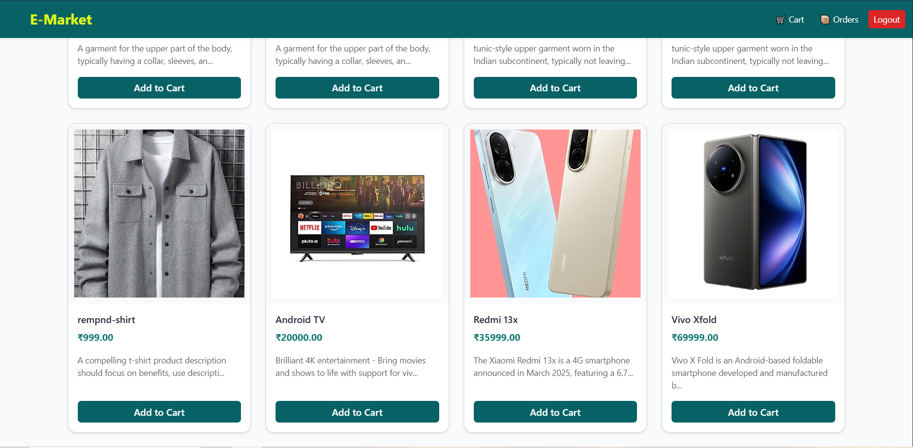
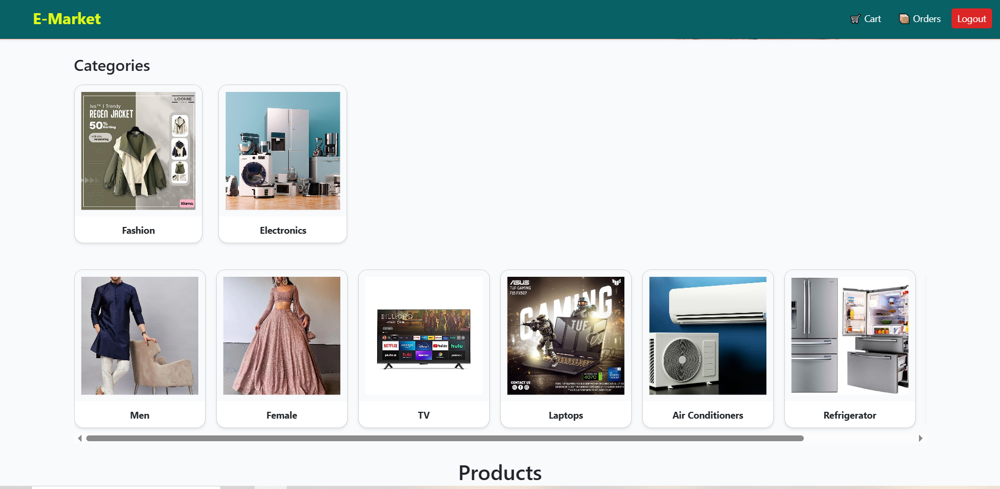
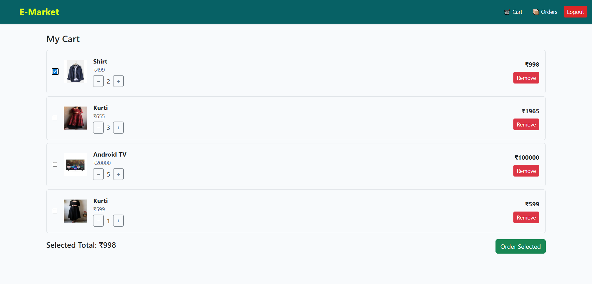
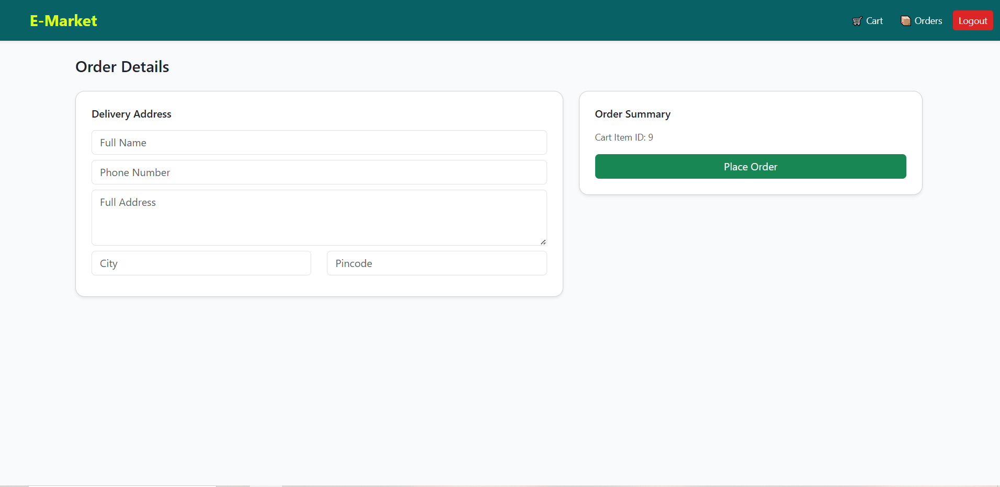
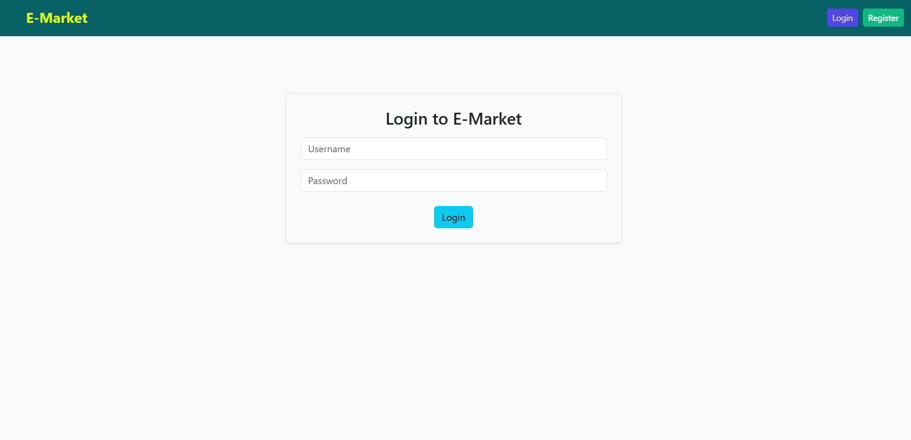

🛒 E-commerce Platform (Django + React)

A full-stack E-commerce web application built using Django, Django REST Framework, and React.
The platform supports product browsing, category & sub-category filtering, cart management, and order placement with JWT authentication.

🔥 Features
👤 Authentication

JWT-based authentication (Login / Register)

Protected routes for cart and orders

User-specific cart and order history

📦 Products & Categories

Product listing with images

Category & Sub-category filtering

Dynamic product loading from backend APIs

🛒 Cart

Add products to cart

Increase / decrease quantity

Prevent quantity exceeding stock

Remove items from cart

Select specific items for checkout

📑 Orders

Place orders for selected cart items only

Order form with delivery address details

View order history

Order details page with items and status

🎨 UI

Responsive UI using Bootstrap

Sticky navigation bar

Clean and professional design

🧰 Tech Stack
Backend

Python

Django

Django REST Framework

JWT Authentication (SimpleJWT)

SQLite (can be switched to PostgreSQL)

Frontend

React

React Router

Axios

Bootstrap 5

🔑 API Endpoints (Sample)
Authentication

POST /api/v1/register/

POST /api/v1/token/

POST /api/v1/token/refresh/

Products

GET /api/v1/products/

GET /api/v1/category/

GET /api/v1/sub_category/

Cart

GET /api/v1/cart/items/

POST /api/v1/cart/items/add/

PATCH /api/v1/cart/items/<id>/

DELETE /api/v1/cart/items/<id>/

Orders

POST /api/v1/place-order/

GET /api/v1/orders/

GET /api/v1/orders/<id>/

⚙️ Setup Instructions
Backend Setup
git clone https://github.com/your-username/ecommerce-platform.git
cd backend
python -m venv env
env\Scripts\activate   # Windows
pip install -r requirements.txt
python manage.py migrate
python manage.py createsuperuser
python manage.py runserver

Frontend Setup
cd frontend
npm install
npm run dev

## 📸 Screenshots

### 🏠 Home Page

### 🛍️ category Page

### 🛒 Cart Page

### 📝 Order Form

### 📝 Login Form

🚀 Future Enhancements

Payment gateway integration

Admin dashboard

Order status notifications

Wishlist functionality

👨‍💻 Author

Vivek More
Python | Django | DRF | React Developer

📌 LinkedIn: Add your LinkedIn link
📌 GitHub: Add your GitHub repo link

⭐ Support

If you like this project, please ⭐ the repository!

